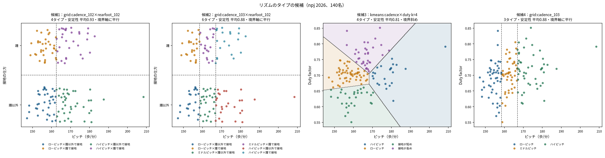
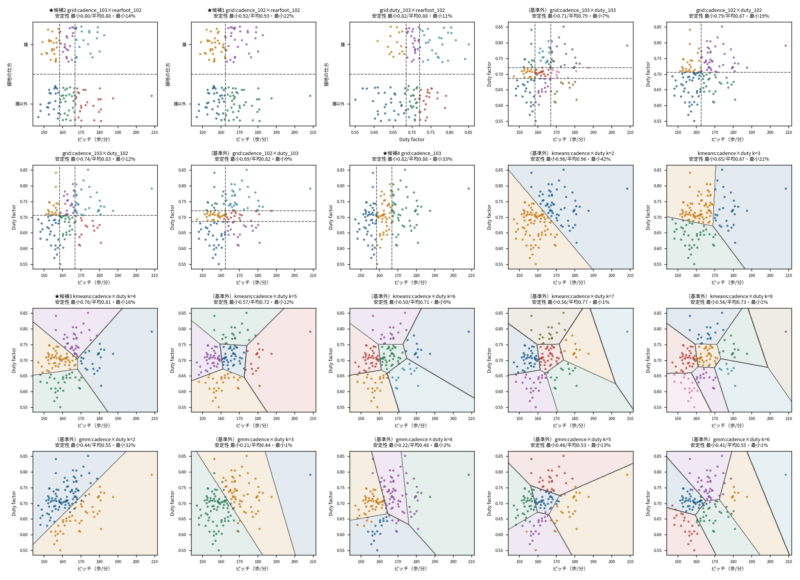
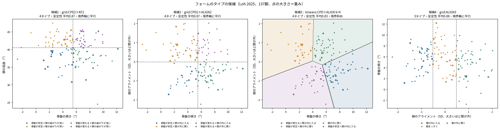
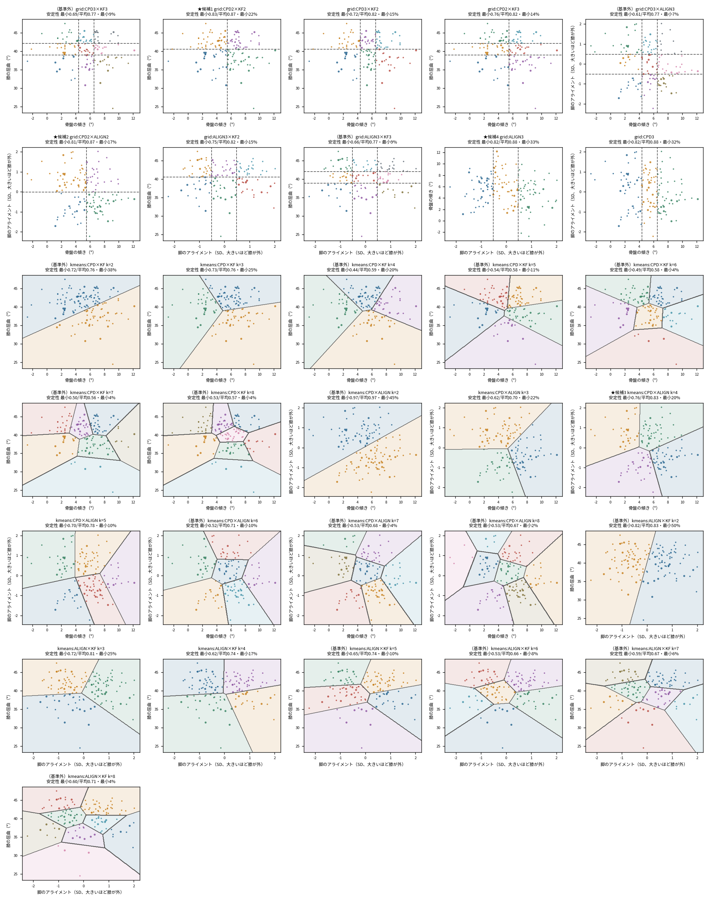

# ステップ3-3 結果：見やすいタイプの分け方の探索

予測に使わない前提で、「分布図の2軸 = タイプを作る項目」になる分け方を比べた。ケガとの関係は評価に使っていない。

- 区切り（grid）：軸ごとに参加者の順位で2区分（中央値）か3区分（3等分）。境界は軸に平行な直線
- k-means：2軸だけでクラスタリング（k=2〜8）。境界は斜めの直線
- 混合ガウスモデル（リズムのみ）：どれも安定性が低く、基準を満たさなかった
- 脚のアライメント：股関節の内転の値と膝の外反の標準化の平均（相関0.64）。大きいほど「股関節の内転が小さく膝が外に開く」と解釈（未確定）
- 絞り込みの基準：安定性の最小 ≥ 0.6、最小タイプ ≥ 10%、3〜9タイプ → 2軸の区切りの上位2つ、k-means の上位1つ、1軸の区切りの上位1つ（安定性の平均 → 偏りの小ささの順）

## リズム（npj 2026、140名）

### 絞り込んだ候補

| 候補 | 分け方 | タイプの数 | 安定性（最小／平均） | 最小タイプ | 境界 | 膝の外反を使う | タイプ（割合） |
|---|---|---|---|---|---|---|---|
| 1 | grid:cadence_102×rearfoot_102 | 4 | 0.92／0.93 | 22% | 軸に平行 | いいえ | ローピッチ×踵以外で接地（26%） / ローピッチ×踵で接地（24%） / ハイピッチ×踵以外で接地（28%） / ハイピッチ×踵で接地（22%） |
| 2 | grid:cadence_103×rearfoot_102 | 6 | 0.80／0.88 | 14% | 軸に平行 | いいえ | ローピッチ×踵以外で接地（16%） / ローピッチ×踵で接地（17%） / ミドルピッチ×踵以外で接地（19%） / ミドルピッチ×踵で接地（14%） / ハイピッチ×踵以外で接地（19%） / ハイピッチ×踵で接地（15%） |
| 3 | kmeans:cadence×duty k=4 | 4 | 0.76／0.81 | 16% | 斜め | いいえ | ハイピッチ（16%） / ローピッチ（39%） / 接地が短め（21%） / 接地が長め（24%） |
| 4 | grid:cadence_103 | 3 | 0.82／0.88 | 33% | 軸に平行 | いいえ | ローピッチ（34%） / ミドルピッチ（33%） / ハイピッチ（34%） |

### 全候補

| 分け方 | タイプの数 | 安定性（最小／平均） | 最小タイプ | 偏り（1=均等） | シルエット係数 | 基準を満たす |
|---|---|---|---|---|---|---|
| grid:cadence_103×rearfoot_102 | 6 | 0.80／0.88 | 14% | 1.00 | 0.46 | ✅ |
| grid:cadence_102×rearfoot_102 | 4 | 0.92／0.93 | 22% | 1.00 | 0.53 | ✅ |
| grid:duty_103×rearfoot_102 | 6 | 0.82／0.88 | 11% | 0.99 | 0.45 | ✅ |
| grid:cadence_103×duty_103 | 9 | 0.71／0.79 | 7% | 0.99 | 0.16 |  |
| grid:cadence_102×duty_102 | 4 | 0.79／0.87 | 19% | 0.98 | 0.22 | ✅ |
| grid:cadence_103×duty_102 | 6 | 0.74／0.83 | 12% | 0.99 | 0.18 | ✅ |
| grid:cadence_102×duty_103 | 6 | 0.69／0.82 | 9% | 0.97 | 0.20 |  |
| grid:cadence_103 | 3 | 0.82／0.88 | 33% | 1.00 | 0.46 | ✅ |
| kmeans:cadence×duty k=2 | 2 | 0.96／0.96 | 42% | 0.98 | 0.37 |  |
| kmeans:cadence×duty k=3 | 3 | 0.65／0.67 | 21% | 0.93 | 0.35 | ✅ |
| kmeans:cadence×duty k=4 | 4 | 0.76／0.81 | 16% | 0.96 | 0.37 | ✅ |
| kmeans:cadence×duty k=5 | 5 | 0.57／0.72 | 12% | 0.97 | 0.37 |  |
| kmeans:cadence×duty k=6 | 6 | 0.50／0.71 | 9% | 0.95 | 0.39 |  |
| kmeans:cadence×duty k=7 | 7 | 0.56／0.77 | 1% | 0.89 | 0.39 |  |
| kmeans:cadence×duty k=8 | 8 | 0.56／0.73 | 1% | 0.89 | 0.39 |  |
| gmm:cadence×duty k=2 | 2 | 0.44／0.55 | 32% | 0.91 | 0.31 |  |
| gmm:cadence×duty k=3 | 3 | 0.21／0.44 | 1% | 0.65 | 0.35 |  |
| gmm:cadence×duty k=4 | 4 | 0.22／0.48 | 2% | 0.76 | 0.27 |  |
| gmm:cadence×duty k=5 | 5 | 0.46／0.53 | 13% | 0.98 | 0.26 |  |
| gmm:cadence×duty k=6 | 6 | 0.41／0.55 | 1% | 0.85 | 0.34 |  |

## フォーム（Loh 2025、81名・137脚）

### 絞り込んだ候補

| 候補 | 分け方 | タイプの数 | 安定性（最小／平均） | 最小タイプ | 境界 | 膝の外反を使う | タイプ（割合） |
|---|---|---|---|---|---|---|---|
| 1 | grid:CPD2×KF2 | 4 | 0.83／0.87 | 22% | 軸に平行 | いいえ | 骨盤が安定×膝の曲がりが浅い（22%） / 骨盤が安定×膝の曲がりが深い（28%） / 骨盤が落ちる×膝の曲がりが浅い（28%） / 骨盤が落ちる×膝の曲がりが深い（22%） |
| 2 | grid:CPD2×ALIGN2 | 4 | 0.81／0.87 | 17% | 軸に平行 | はい | 骨盤が安定×膝が内に入る（17%） / 骨盤が安定×膝が外に開く（33%） / 骨盤が落ちる×膝が内に入る（33%） / 骨盤が落ちる×膝が外に開く（17%） |
| 3 | kmeans:CPD×ALIGN k=4 | 4 | 0.76／0.83 | 20% | 斜め | はい | 骨盤が落ちる×膝が内に入る（31%） / 骨盤が安定×膝が外に開く（21%） / 膝が外に開く（28%） / 骨盤が安定×膝が内に入る（20%） |
| 4 | grid:ALIGN3 | 3 | 0.82／0.88 | 33% | 軸に平行 | はい | 膝が内に入る（33%） / 脚まっすぐ（34%） / 膝が外に開く（33%） |

### 全候補

| 分け方 | タイプの数 | 安定性（最小／平均） | 最小タイプ | 偏り（1=均等） | シルエット係数 | 基準を満たす |
|---|---|---|---|---|---|---|
| grid:CPD3×KF3 | 9 | 0.69／0.77 | 9% | 1.00 | 0.23 |  |
| grid:CPD2×KF2 | 4 | 0.83／0.87 | 22% | 0.99 | 0.28 | ✅ |
| grid:CPD3×KF2 | 6 | 0.72／0.82 | 15% | 1.00 | 0.24 | ✅ |
| grid:CPD2×KF3 | 6 | 0.76／0.82 | 14% | 1.00 | 0.22 | ✅ |
| grid:CPD3×ALIGN3 | 9 | 0.61／0.77 | 7% | 0.99 | 0.24 |  |
| grid:CPD2×ALIGN2 | 4 | 0.81／0.87 | 17% | 0.96 | 0.32 | ✅ |
| grid:ALIGN3×KF2 | 6 | 0.75／0.82 | 15% | 1.00 | 0.26 | ✅ |
| grid:ALIGN3×KF3 | 9 | 0.66／0.77 | 9% | 0.99 | 0.24 |  |
| grid:ALIGN3 | 3 | 0.82／0.88 | 33% | 1.00 | 0.50 | ✅ |
| grid:CPD3 | 3 | 0.82／0.88 | 32% | 1.00 | 0.49 | ✅ |
| kmeans:CPD×KF k=2 | 2 | 0.72／0.76 | 38% | 0.96 | 0.34 |  |
| kmeans:CPD×KF k=3 | 3 | 0.73／0.76 | 25% | 0.97 | 0.36 | ✅ |
| kmeans:CPD×KF k=4 | 4 | 0.44／0.59 | 20% | 0.98 | 0.32 |  |
| kmeans:CPD×KF k=5 | 5 | 0.54／0.58 | 11% | 0.97 | 0.31 |  |
| kmeans:CPD×KF k=6 | 6 | 0.49／0.58 | 4% | 0.94 | 0.34 |  |
| kmeans:CPD×KF k=7 | 7 | 0.50／0.56 | 4% | 0.93 | 0.33 |  |
| kmeans:CPD×KF k=8 | 8 | 0.53／0.57 | 4% | 0.97 | 0.33 |  |
| kmeans:CPD×ALIGN k=2 | 2 | 0.97／0.97 | 45% | 0.99 | 0.40 |  |
| kmeans:CPD×ALIGN k=3 | 3 | 0.62／0.70 | 22% | 0.96 | 0.36 | ✅ |
| kmeans:CPD×ALIGN k=4 | 4 | 0.76／0.83 | 20% | 0.99 | 0.38 | ✅ |
| kmeans:CPD×ALIGN k=5 | 5 | 0.70／0.78 | 10% | 0.95 | 0.39 | ✅ |
| kmeans:CPD×ALIGN k=6 | 6 | 0.52／0.71 | 10% | 0.98 | 0.37 |  |
| kmeans:CPD×ALIGN k=7 | 7 | 0.53／0.68 | 4% | 0.95 | 0.38 |  |
| kmeans:CPD×ALIGN k=8 | 8 | 0.53／0.67 | 2% | 0.92 | 0.39 |  |
| kmeans:ALIGN×KF k=2 | 2 | 0.82／0.83 | 50% | 1.00 | 0.36 |  |
| kmeans:ALIGN×KF k=3 | 3 | 0.72／0.81 | 25% | 0.98 | 0.39 | ✅ |
| kmeans:ALIGN×KF k=4 | 4 | 0.62／0.74 | 17% | 0.98 | 0.36 | ✅ |
| kmeans:ALIGN×KF k=5 | 5 | 0.65／0.74 | 10% | 0.96 | 0.36 |  |
| kmeans:ALIGN×KF k=6 | 6 | 0.53／0.66 | 8% | 0.96 | 0.36 |  |
| kmeans:ALIGN×KF k=7 | 7 | 0.59／0.67 | 6% | 0.95 | 0.36 |  |
| kmeans:ALIGN×KF k=8 | 8 | 0.60／0.71 | 4% | 0.93 | 0.37 |  |

## 読み方

- 区切り（grid）は、順位で区切るので人数がほぼ均等になり、境界も分布図にまっすぐ引ける。ただし、データにかたまりがあるわけではないので、境界の近くの人は「どちらにも近い」
- k-means は、分布の形に合わせて境界が斜めになる。k を増やすと安定性がすぐ下がった（リズムは k=5 以上、フォームは k=6 以上で基準を下回る）
- 接地の仕方（踵かそれ以外か）は2値なので、リズムの区切りに入れると安定してはっきり分かれる
