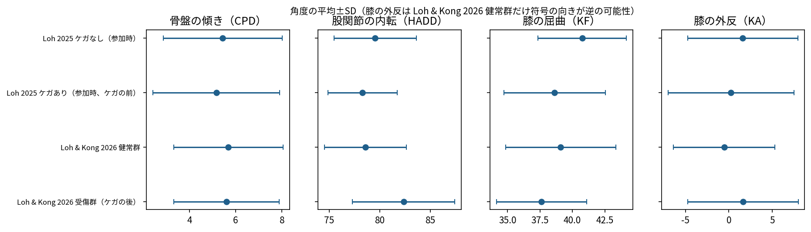
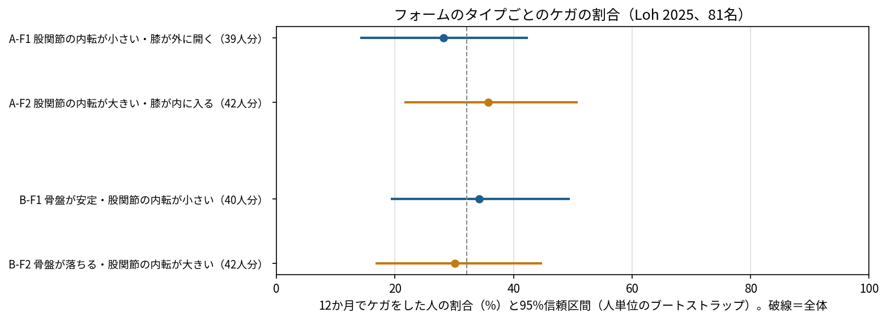
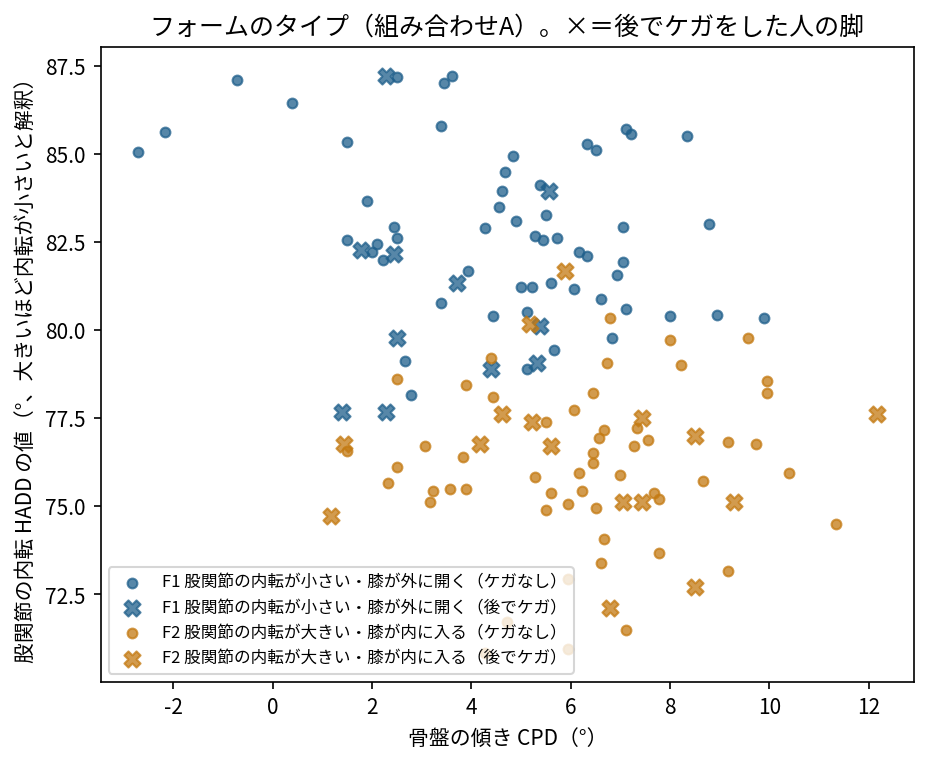

# ステップ3-2 結果：フォームのタイプ分け（Loh 2025）

## 結論

- **タイプ間でケガの割合に統計的な差はなかった。** 組み合わせA（骨盤の傾き, 股関節の内転, 膝の屈曲, 膝の外反、kmeans・2タイプ）の12か月でケガをした割合：F1 股関節の内転が小さい・膝が外に開く（39人分）28%（14%〜42%）、F2 股関節の内転が大きい・膝が内に入る（42人分）36%（22%〜51%）。並べ替え検定 p=0.44。組み合わせB、調整、感度分析でも同じ。
- タイプに分けずに見ると、**膝の屈曲**だけ、立脚中期に膝が深く曲がっているほどケガが少ない傾向があった（1SDあたりのオッズ比 0.55［0.27〜0.88］、p=0.021。4角度を一緒に入れても 0.51［0.23〜0.84］）。ただし4つの角度を試した中の1つで、多重比較を考えると偶然の可能性がある（Bonferroni 補正後は p≈0.08）。**探索的な傾向**として扱う
- **ケガの前とケガの後で、股関節の内転の値の特徴が違った。** Loh & Kong 2026 の受傷群（ケガの後）は健常群より約0.9SD大きいが、Loh 2025 で後でケガをした人（ケガの前）はほぼ差がない（下の尺度の表）。ケガの後の走り方の違いは、原因ではなく、かばった結果である可能性を示す
- 人数が少なく（ケガ26名）、検出できるのは大きな差だけ（下表）。「差がない」ではなく「大きな差はない」と解釈する

## データと重み

- Loh 2025 の81名、角度がある脚 137 脚（ケガなし55名 110脚、ケガあり26名 27脚）
- ケガをした人は1名を除き片脚だけに角度があるので、脚を単位にし、重み = 1 ÷ その人の脚の数（ケガなしの人の脚は0.5）とした。信頼区間と安定性は人単位のブートストラップ
- 1人1行・重みなし（角度のある脚の平均）で分けた場合は感度分析に示した

## 角度の尺度と向き

| グループ | 骨盤の傾き | 股関節の内転 | 膝の屈曲 | 膝の外反 |
|---|---|---|---|---|
| Loh 2025 ケガなし（参加時） | 5.4 ± 2.6（-0.10SD） | 79.5 ± 4.1（+0.24SD） | 40.8 ± 3.4（+0.39SD） | 1.6 ± 6.3（+0.37SD） |
| Loh 2025 ケガあり（参加時、ケガの前） | 5.2 ± 2.8（-0.22SD） | 78.3 ± 3.4（-0.07SD） | 38.6 ± 3.9（-0.11SD） | 0.2 ± 7.2（+0.13SD） |
| Loh & Kong 2026 健常群 | 5.7 ± 2.4（+0.00SD） | 78.6 ± 4.0（+0.00SD） | 39.1 ± 4.2（+0.00SD） | -0.5 ± 5.8（+0.00SD） |
| Loh & Kong 2026 受傷群（ケガの後） | 5.6 ± 2.3（-0.03SD） | 82.4 ± 5.1（+0.94SD） | 37.6 ± 3.5（-0.35SD） | 1.6 ± 6.3（+0.37SD） |

（ ）内は Loh & Kong 2026 健常群との標準化平均差。膝の外反は健常群の符号の向きが逆の可能性があるので、比較に使えない。

| グループ | 脚 | 人数 | 相関（骨盤の傾き・股関節の内転） | 相関（股関節の内転・膝の外反） |
|---|---|---|---|---|
| Loh 2025 ケガなし（参加時） | L | 55 | -0.46 | +0.63 |
| Loh 2025 ケガなし（参加時） | R | 55 | -0.16 | +0.72 |
| Loh 2025 ケガあり（参加時、ケガの前） | L | 14 | -0.30 | +0.74 |
| Loh 2025 ケガあり（参加時、ケガの前） | R | 13 | -0.66 | +0.42 |
| Loh & Kong 2026 健常群 | L | 44 | -0.22 | -0.71 |
| Loh & Kong 2026 健常群 | R | 44 | -0.43 | -0.55 |
| Loh & Kong 2026 受傷群（ケガの後） | L | 98 | -0.29 | +0.71 |
| Loh & Kong 2026 受傷群（ケガの後） | R | 104 | -0.22 | +0.79 |

- **Loh & Kong 2026 の健常群だけ、股関節の内転と膝の外反の相関が負**（他は正）。健常群のシートは膝の外反の符号の向きが逆の可能性が高い
- 骨盤の傾きと股関節の内転の値は、すべてのデータで負の相関。反対側の骨盤が落ちるほど立脚側の内転は大きくなるはずなので、**股関節の内転の値は「大きいほど内転が小さい（約90°−内転）」、膝の外反の値は「正のとき膝が外に開く」と解釈してタイプに名前を付けた**（未確定。ステップ2で動画から角度の定義を合わせるときに確かめる）

## 分け方の選択（ケガの結果を見る前に決めた基準）

基準：人単位のブートストラップで全タイプの安定性0.6以上・重み付き15人分以上 → 重み付きシルエット係数が最も高いもの（差0.02以内ならタイプの数が少ないほう）→ なければルール。

| 組み合わせ | 方法 | タイプの数 | シルエット係数（重み付き） | 最小（人分） | 安定性（最小） | 採用 |
|---|---|---|---|---|---|---|
| A | kmeans | 2 | 0.302 | 39.0 | 0.96 | ✅ |
| A | kmeans | 3 | 0.257 | 22.0 | 0.66 |  |
| A | kmeans | 4 | 0.226 | 17.0 | 0.53 |  |
| A | gmm_diag | 2 | 0.297 | 38.0 | 0.94 |  |
| A | gmm_diag | 3 | 0.238 | 8.0 | 0.33 |  |
| A | rule_q4 | 4 | 0.098 | 2.0 | 0.76 |  |
| A | rule_q3 | 3 | 0.138 | 19.0 | 0.86 |  |
| A | rule_med | 4 | 0.144 | 15.0 | 0.83 |  |
| B | kmeans | 2 | 0.268 | 39.5 | 0.82 | ✅ |
| B | kmeans | 3 | 0.248 | 19.0 | 0.55 |  |
| B | kmeans | 4 | 0.249 | 13.0 | 0.61 |  |
| B | gmm_diag | 2 | 0.255 | 20.5 | 0.52 |  |
| B | gmm_diag | 3 | 0.206 | 17.0 | 0.27 |  |
| B | rule_q4 | 4 | 0.145 | 2.0 | 0.76 |  |
| B | rule_q3 | 3 | 0.184 | 19.0 | 0.86 |  |
| B | rule_med | 4 | 0.181 | 15.0 | 0.84 |  |

採用した分け方：

- **A**（骨盤の傾き, 股関節の内転, 膝の屈曲, 膝の外反）：kmeans、2タイプ。基準を満たす k-means・混合ガウスモデルのうち、重み付きシルエット係数が最も高い（0.02 以内ならタイプの数が少ないほう）
  - F1 股関節の内転が小さい・膝が外に開く（39人分、67脚）：骨盤の傾き -0.41SD, 股関節の内転 +0.82SD, 膝の屈曲 -0.00SD, 膝の外反 +0.77SD
  - F2 股関節の内転が大きい・膝が内に入る（42人分、70脚）：骨盤の傾き +0.38SD, 股関節の内転 -0.76SD, 膝の屈曲 +0.00SD, 膝の外反 -0.71SD
- **B**（骨盤の傾き, 股関節の内転, 膝の屈曲）：kmeans、2タイプ。基準を満たす k-means・混合ガウスモデルのうち、重み付きシルエット係数が最も高い（0.02 以内ならタイプの数が少ないほう）
  - F1 骨盤が安定・股関節の内転が小さい（40人分、66脚）：骨盤の傾き -0.64SD, 股関節の内転 +0.68SD, 膝の屈曲 -0.22SD, 膝の外反 +0.41SD
  - F2 骨盤が落ちる・股関節の内転が大きい（42人分、71脚）：骨盤の傾き +0.61SD, 股関節の内転 -0.65SD, 膝の屈曲 +0.21SD, 膝の外反 -0.39SD

## タイプごとのケガの割合

| 組み合わせ | タイプ | 人分 | 12か月でケガをした割合（95%CI、ブートストラップ） | 参考：Wilson 法 |
|---|---|---|---|---|
| A | F1 股関節の内転が小さい・膝が外に開く | 39.0 | 28%（14%〜42%） | 17%〜44% |
| A | F2 股関節の内転が大きい・膝が内に入る | 42.0 | 36%（22%〜51%） | 23%〜51% |
| B | F1 骨盤が安定・股関節の内転が小さい | 39.5 | 34%（20%〜49%） | 21%〜50% |
| B | F2 骨盤が落ちる・股関節の内転が大きい | 41.5 | 30%（17%〜45%） | 18%〜45% |

| 組み合わせ | タイプ | 比較（調整） | オッズ比（95%CI） |
|---|---|---|---|
| A | F1 | OR_vs_F2（調整なし） | 0.71（0.24〜1.75） |
| A | F1 | OR_vs_F2（＋性別・年齢） | 0.89（0.26〜2.56） |
| A | F1 | OR_vs_F2（＋週の走行距離） | 0.89（0.25〜2.78） |
| B | F1 | OR_vs_F2（調整なし） | 1.20（0.50〜3.13） |
| B | F1 | OR_vs_F2（＋性別・年齢） | 1.38（0.56〜3.78） |
| B | F1 | OR_vs_F2（＋週の走行距離） | 1.38（0.55〜3.94） |

| 組み合わせ | 検定 | p |
|---|---|---|
| A | 人単位の並べ替え検定（タイプ×ケガ） | 0.440 |
| B | 人単位の並べ替え検定（タイプ×ケガ） | 0.674 |

## タイプに分けずに見た場合（重み付きロジスティック回帰、1SDあたり）

| モデル | 角度 | オッズ比（95%CI） | p（ブートストラップ） |
|---|---|---|---|
| 骨盤の傾きだけ | 骨盤の傾き | 0.90（0.54〜1.40） | 0.605 |
| 股関節の内転だけ | 股関節の内転 | 0.72（0.45〜1.10） | 0.128 |
| 膝の屈曲だけ | 膝の屈曲 | 0.55（0.27〜0.88） | 0.021 |
| 膝の外反だけ | 膝の外反 | 0.81（0.46〜1.33） | 0.392 |
| 4つの角度を一緒に | 骨盤の傾き | 0.69（0.35〜1.22） | 0.187 |
| 4つの角度を一緒に | 股関節の内転 | 0.54（0.24〜1.13） | 0.093 |
| 4つの角度を一緒に | 膝の屈曲 | 0.51（0.23〜0.84） | 0.008 |
| 4つの角度を一緒に | 膝の外反 | 1.16（0.49〜2.68） | 0.644 |

## 感度分析（組み合わせA）

| 分析 | 人分 | タイプごとのケガの割合 | 並べ替え検定 p |
|---|---|---|---|
| 重み付けせず、1人1行（角度のある脚の平均）で分け直す［偏りの確認］ | 81.0 | F1 26%（14%〜41%, 42.0人分）; F2 38%（25%〜55%, 39.0人分） | 0.35 |
| 左脚だけで分け直す | 69.0 | F1 18%（8%〜32%, 38.0人分）; F2 23%（9%〜38%, 31.0人分） | 0.76 |
| 右脚だけで分け直す | 68.0 | F1 12%（3%〜25%, 33.0人分）; F2 26%（12%〜41%, 35.0人分） | 0.23 |
| 時速10km相当に速度補正した角度で分け直す | 81.0 | F1 32%（18%〜47%, 37.5人分）; F2 32%（19%〜46%, 43.5人分） | 1.00 |
| 参考：同じ方法で 3 タイプ | 81.0 | F1 27%（14%〜43%, 36.5人分）; F2 31%（14%〜50%, 22.5人分）; F3 41%（21%〜60%, 22.0人分） | 0.51 |
| 参考：組み合わせB（kmeans、2タイプ） | 81.0 | F1 34%（21%〜48%, 39.5人分）; F2 30%（17%〜43%, 41.5人分） | 0.68 |

- 左脚だけ・右脚だけの分析では、反対側の脚にだけ角度があるケガの人が入らないので、ケガの割合は低めに出る（タイプ間の向きを見るためのもの）

## 検出できる差の大きさ（有意水準5%、検出力80%）

| 組み合わせ | 比較 | 基準のタイプのケガの割合 | 検出できるもう一方の割合 |
|---|---|---|---|
| A | F1 vs F2 | 36% | 10% 以下 または 66% 以上 |
| B | F1 vs F2 | 30% | 6% 以下 または 61% 以上 |

## 判定の準備（ステップ3-3）

- `types_form.json` に、脚ごとの判定に必要な値（標準化の平均と SD、タイプの中心、近いタイプなしの閾値、速度の補正、角度の基準の分布、角度の向きの前提）を書き出した
- 速度 1 km/h あたりの角度の変化：骨盤の傾き +0.16°, 股関節の内転 +0.39°, 膝の屈曲 +0.56°, 膝の外反 +1.79°
- 動画の角度は、Loh の定義と向きに合わせてから当てはめる必要がある（ステップ2）。Fukuchi の3D角度は定義が違うので、ここでは確認に使っていない

## 限界

- 81名（ケガ26名）と少なく、大きな差しか検出できない
- ケガの部位・種類・時期は分からない
- ケガをした人は片脚の角度しかなく、それがケガをした側かどうかは未確認
- 股関節の内転と膝の外反の値の向きは、相関から推定したもので未確定
- Loh & Kong 2026 健常群の膝の外反は、符号の向きが逆の可能性がある
- 2D動画の角度は、カメラの位置や撮り方で変わる
