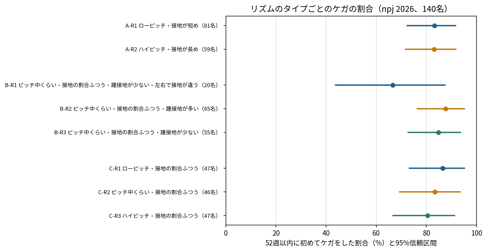
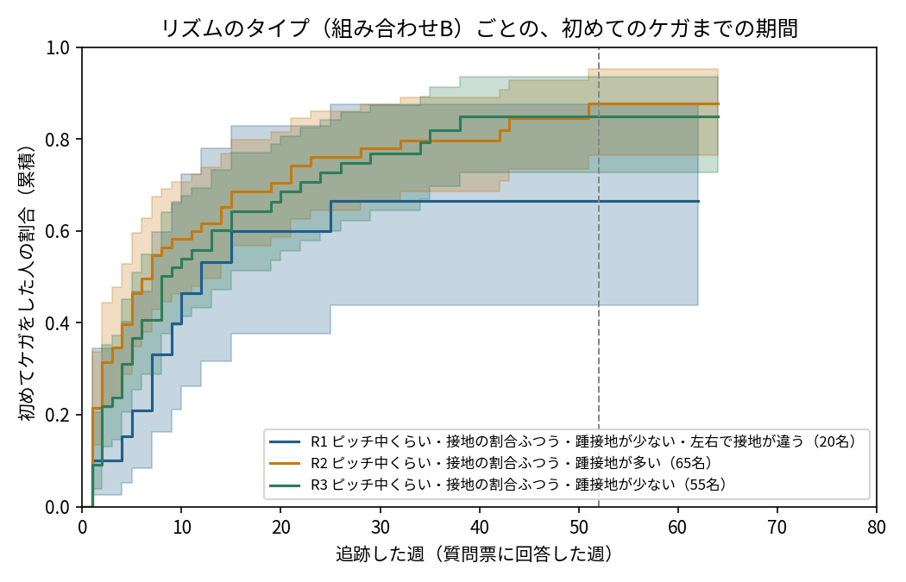

# ステップ3-1 結果：リズムのタイプ分け（npj 2026）

## 結論

- **画面に使うのは組み合わせB**（cadence_10, duty_10, cadence_asym_pct_10, duty_asym_pct_10, rearfoot_10, alt_strike、kmeans・3タイプ）。9/17 にユーザーの判断で A から変更した。
- **どの分け方でも、タイプ間でケガの多さに統計的な差はなかった。** 組み合わせBの52週以内に初めてケガをした割合：R1 ピッチ中くらい・接地の割合ふつう・踵接地が少ない・左右で接地が違う（20名）67%、R2 ピッチ中くらい・接地の割合ふつう・踵接地が多い（65名）88%、R3 ピッチ中くらい・接地の割合ふつう・踵接地が少ない（55名）85%。ハザード比（基準＝R2）：R1 0.55（0.29〜1.06）、R3 0.86（0.58〜1.30）。log-rank p=0.20。
- タイプに分けず、ピッチと Duty factor を連続値のまま入れても関係は見えなかった（下表）。ケガ歴・練習量で調整しても、感度分析でも結論は同じ。
- ただし、この人数（ケガ 105 名）で検出できるのはハザード比が約1.7以上の差だけ。**「差がない」ではなく「大きな差はない」**と解釈する。
- 参加者のケガの割合が非常に高い（52週以内に約84%）ため、タイプによる差が出にくい集団でもある。
- プロトタイプでは、タイプとケガの割合を信頼区間つきで表示し、「タイプ間で差は見られなかった」ことを明記する。

## データ

- npj 2026 の142名のうち、走り方の値を埋めたと思われる2名（ID 70・71。タイミングの全項目が完全に同じで、女性の中央値とほぼ一致）を除いた **140名**
  - 論文では「1名を中央値で埋めた」とあるが、データでは2名が該当した。2名とも除き、含めた場合は感度分析で確認した
  - 論文によると、停電で2名は約4か月後に走り方を測定している。誰かは特定できない
- ケガ（追跡中に1回以上）：105名。追跡した週数の中央値：52週（1〜80）
- 走り方は参加時に1回だけ測った値（時速10km）。ピッチと Duty factor は、ステップ1で Fukuchi の平均を基準に元の単位に戻した値

## 分け方の選択（ケガの結果を見る前に決めた基準）

基準：全タイプで安定性（Jaccard 係数）0.6以上・20名以上 → シルエット係数が最も高いもの（差が0.02以内ならタイプの数が少ないほう）。

| 組み合わせ | 方法 | タイプの数 | シルエット係数 | 最小人数 | 安定性（最小） | 採用 |
|---|---|---|---|---|---|---|
| A | kmeans | 2 | 0.372 | 59 | 0.96 | ✅ |
| A | kmeans | 3 | 0.350 | 29 | 0.65 |  |
| A | kmeans | 4 | 0.374 | 23 | 0.76 |  |
| A | kmeans | 5 | 0.369 | 17 | 0.53 |  |
| A | gmm_full | 2 | 0.314 | 45 | 0.42 |  |
| A | gmm_full | 3 | 0.350 | 1 | 0.12 |  |
| A | gmm_full | 4 | 0.263 | 4 | 0.20 |  |
| A | gmm_full | 5 | 0.262 | 18 | 0.46 |  |
| A | gmm_diag | 2 | 0.360 | 58 | 0.77 |  |
| A | gmm_diag | 3 | 0.345 | 1 | 0.13 |  |
| A | gmm_diag | 4 | 0.104 | 1 | 0.26 |  |
| A | gmm_diag | 5 | 0.363 | 8 | 0.38 |  |
| A | rule_2x2 | 4 | 0.222 | 26 | 0.81 |  |
| B | kmeans | 2 | 0.205 | 65 | 0.91 |  |
| B | kmeans | 3 | 0.248 | 20 | 0.92 | ✅ |
| B | kmeans | 4 | 0.226 | 20 | 0.52 |  |
| B | kmeans | 5 | 0.214 | 20 | 0.54 |  |
| B | gmm_full | 2 | 0.205 | 65 | 0.71 |  |
| B | gmm_full | 3 | 0.248 | 20 | 0.90 |  |
| B | gmm_full | 4 | 0.236 | 4 | 0.14 |  |
| B | gmm_full | 5 | 0.219 | 2 | 0.17 |  |
| B | gmm_diag | 2 | 0.205 | 65 | 0.75 |  |
| B | gmm_diag | 3 | 0.248 | 20 | 0.92 |  |
| B | gmm_diag | 4 | 0.229 | 4 | 0.18 |  |
| B | gmm_diag | 5 | 0.217 | 1 | 0.28 |  |
| B | rule_2x2 | 4 | 0.048 | 26 | 0.80 |  |
| C | rule_tertile | 3 | 0.461 | 46 | 0.84 | ✅ |

採用した分け方：

- **A**（cadence_10, duty_10）：kmeans、2タイプ。基準を満たす k-means・混合ガウスモデルのうち、シルエット係数が最も高い（0.02 以内ならタイプの数が少ないほう）
  - R1 ローピッチ・接地が短め（81名）：平均 cadence_10 158.3, duty_10 0.675
  - R2 ハイピッチ・接地が長め（59名）：平均 cadence_10 171.3, duty_10 0.739
- **B**（cadence_10, duty_10, cadence_asym_pct_10, duty_asym_pct_10, rearfoot_10, alt_strike）：kmeans、3タイプ。基準を満たす k-means・混合ガウスモデルのうち、シルエット係数が最も高い（0.02 以内ならタイプの数が少ないほう）
  - R1 ピッチ中くらい・接地の割合ふつう・踵接地が少ない・左右で接地が違う（20名）：平均 cadence_10 160.6, duty_10 0.690, cadence_asym_pct_10 57.0, duty_asym_pct_10 47.6, rearfoot_10 0.000, alt_strike 1.000
  - R2 ピッチ中くらい・接地の割合ふつう・踵接地が多い（65名）：平均 cadence_10 163.1, duty_10 0.719, cadence_asym_pct_10 50.7, duty_asym_pct_10 49.3, rearfoot_10 1.000, alt_strike 0.000
  - R3 ピッチ中くらい・接地の割合ふつう・踵接地が少ない（55名）：平均 cadence_10 165.8, duty_10 0.686, cadence_asym_pct_10 47.5, duty_asym_pct_10 52.8, rearfoot_10 0.000, alt_strike 0.000
- **C**（cadence_10）：rule_tertile、3タイプ。設計どおり、ピッチの3等分（1項目なのでクラスタリングはしない）
  - R1 ローピッチ・接地の割合ふつう（47名）：平均 cadence_10 154.5
  - R2 ピッチ中くらい・接地の割合ふつう（46名）：平均 cadence_10 162.9
  - R3 ハイピッチ・接地の割合ふつう（47名）：平均 cadence_10 174.0

- 組み合わせBは、主に「踵から接地するか」「左右で接地の仕方が違うか」で分かれた（ピッチと Duty factor はタイプ間でほぼ同じ）

## タイプごとのケガの多さ





| 組み合わせ | タイプ | 人数 | ケガ | 52週以内のケガの割合（95%CI） | 100週あたりのケガの週（95%CI） |
|---|---|---|---|---|---|
| A | R1 ローピッチ・接地が短め | 81 | 59 | 83%（72%〜92%） | 10.1（8.0〜12.8） |
| A | R2 ハイピッチ・接地が長め | 59 | 46 | 83%（72%〜92%） | 8.1（6.1〜10.6） |
| B | R1 ピッチ中くらい・接地の割合ふつう・踵接地が少ない・左右で接地が違う | 20 | 11 | 67%（44%〜87%） | 7.7（4.6〜13.0） |
| B | R2 ピッチ中くらい・接地の割合ふつう・踵接地が多い | 65 | 51 | 88%（76%〜95%） | 9.8（7.5〜12.7） |
| B | R3 ピッチ中くらい・接地の割合ふつう・踵接地が少ない | 55 | 43 | 85%（73%〜94%） | 9.1（6.9〜12.1） |
| C | R1 ローピッチ・接地の割合ふつう | 47 | 36 | 86%（73%〜95%） | 11.5（8.5〜15.4） |
| C | R2 ピッチ中くらい・接地の割合ふつう | 46 | 35 | 83%（69%〜93%） | 8.1（5.9〜11.0） |
| C | R3 ハイピッチ・接地の割合ふつう | 47 | 34 | 81%（67%〜91%） | 8.2（6.0〜11.3） |

### タイプ間の差の検定

| 組み合わせ | 検定 | p |
|---|---|---|
| A | log-rank（52週以内に限らない、全期間） | 0.585 |
| A | 負の二項回帰（100週あたりのケガの週が等しいか） | 0.221 |
| A | Cox 尤度比検定（調整なし） | 0.563 |
| A | Cox 尤度比検定（＋性別） | 0.545 |
| A | Cox 尤度比検定（＋ケガ歴） | 0.554 |
| A | Cox 尤度比検定（＋練習量） | 0.473 |
| B | log-rank（52週以内に限らない、全期間） | 0.196 |
| B | 負の二項回帰（100週あたりのケガの週が等しいか） | 0.726 |
| B | Cox 尤度比検定（調整なし） | 0.167 |
| B | Cox 尤度比検定（＋性別） | 0.162 |
| B | Cox 尤度比検定（＋ケガ歴） | 0.175 |
| B | Cox 尤度比検定（＋練習量） | 0.259 |
| C | log-rank（52週以内に限らない、全期間） | 0.544 |
| C | 負の二項回帰（100週あたりのケガの週が等しいか） | 0.187 |
| C | Cox 尤度比検定（調整なし） | 0.527 |
| C | Cox 尤度比検定（＋性別） | 0.473 |
| C | Cox 尤度比検定（＋ケガ歴） | 0.482 |
| C | Cox 尤度比検定（＋練習量） | 0.552 |

### ハザード比（基準＝人数が最も多いタイプ）

| 組み合わせ | タイプ | 調整 | ハザード比（95%CI） | p |
|---|---|---|---|---|
| A | R2 | 調整なし | 0.89（0.61〜1.31） | 0.564 |
| A | R2 | ＋性別 | 0.89（0.60〜1.31） | 0.546 |
| A | R2 | ＋ケガ歴 | 0.89（0.60〜1.32） | 0.555 |
| A | R2 | ＋練習量 | 0.86（0.58〜1.29） | 0.474 |
| B | R1 | 調整なし | 0.55（0.29〜1.06） | 0.075 |
| B | R3 | 調整なし | 0.86（0.58〜1.30） | 0.478 |
| B | R1 | ＋性別 | 0.55（0.28〜1.06） | 0.072 |
| B | R3 | ＋性別 | 0.86（0.57〜1.29） | 0.461 |
| B | R1 | ＋ケガ歴 | 0.55（0.28〜1.07） | 0.078 |
| B | R3 | ＋ケガ歴 | 0.86（0.57〜1.30） | 0.484 |
| B | R1 | ＋練習量 | 0.59（0.30〜1.15） | 0.122 |
| B | R3 | ＋練習量 | 0.85（0.56〜1.29） | 0.446 |
| C | R1 | 調整なし | 1.27（0.79〜2.03） | 0.323 |
| C | R2 | 調整なし | 1.26（0.78〜2.02） | 0.341 |
| C | R1 | ＋性別 | 1.34（0.79〜2.25） | 0.275 |
| C | R2 | ＋性別 | 1.27（0.79〜2.05） | 0.319 |
| C | R1 | ＋ケガ歴 | 1.32（0.78〜2.23） | 0.306 |
| C | R2 | ＋ケガ歴 | 1.29（0.80〜2.08） | 0.300 |
| C | R1 | ＋練習量 | 1.33（0.78〜2.29） | 0.295 |
| C | R2 | ＋練習量 | 1.20（0.74〜1.96） | 0.466 |

- 組み合わせBの R1（左右で接地の仕方が違う20名）は、ケガが少ない傾向（ハザード比 約0.55、p≈0.08）だったが、有意ではなく、人数も少ない。複数の比較をしているので偶然の可能性が高い。発表では「探索的な傾向」以上には扱わない

## タイプに分けずに見た場合（連続値の Cox 回帰）

| モデル | 項目 | 1SDあたりのハザード比（95%CI） | p |
|---|---|---|---|
| 直線（ピッチ・Duty factor、1SDあたり） | cadence_10_z | 1.01（0.82〜1.23） | 0.959 |
| 直線（ピッチ・Duty factor、1SDあたり） | duty_10_z | 0.96（0.78〜1.19） | 0.723 |
| 直線＋性別 | cadence_10_z | 1.01（0.80〜1.26） | 0.964 |
| 直線＋性別 | duty_10_z | 0.96（0.78〜1.20） | 0.732 |
| 直線＋ケガ歴＋練習量 | cadence_10_z | 1.02（0.80〜1.30） | 0.875 |
| 直線＋ケガ歴＋練習量 | duty_10_z | 0.92（0.74〜1.15） | 0.489 |
| 曲線（2乗の項を足したときの尤度比検定） | cadence_z2 + duty_z2 | — | 0.114 |

## 感度分析（組み合わせB）

| 分析 | 人数 | タイプごとの52週以内のケガの割合 | log-rank p |
|---|---|---|---|
| 追跡4週未満の人を除く | 133 | R1 65%（42%〜87%, 18名）; R2 88%（77%〜95%, 61名）; R3 85%（73%〜94%, 54名） | 0.13 |
| 追跡の最初の週にケガがあった人を除く | 119 | R1 63%（39%〜86%, 18名）; R2 84%（71%〜94%, 51名）; R3 83%（70%〜93%, 50名） | 0.31 |
| 値を埋めたと思われる2名も含める | 142 | R1 67%（44%〜87%, 20名）; R2 88%（76%〜95%, 65名）; R3 85%（73%〜93%, 57名） | 0.20 |
| 時速12kmの値で分け直す | 140 | R1 67%（44%〜87%, 20名）; R2 89%（79%〜96%, 72名）; R3 82%（69%〜92%, 48名） | 0.14 |
| 身長と性別で補正したピッチで分け直す | 140 | R1 67%（44%〜87%, 20名）; R2 88%（76%〜95%, 65名）; R3 85%（73%〜94%, 55名） | 0.20 |
| 参考：同じ方法で 2 タイプ | 140 | R1 88%（76%〜95%, 65名）; R2 80%（69%〜89%, 75名） | 0.20 |
| 参考：同じ方法で 4 タイプ | 140 | R1 83%（67%〜95%, 36名）; R2 87%（74%〜96%, 55名）; R3 67%（44%〜87%, 20名）; R4 90%（75%〜98%, 29名） | 0.32 |
| 参考：組み合わせA（kmeans、2タイプ） | 140 | R1 83%（72%〜92%, 81名）; R2 83%（72%〜92%, 59名） | 0.58 |
| 参考：組み合わせC（rule_tertile、3タイプ） | 140 | R1 86%（73%〜95%, 47名）; R2 83%（69%〜93%, 46名）; R3 81%（67%〜91%, 47名） | 0.54 |

## 検出できる差の大きさ（有意水準5%、検出力80%）

| 組み合わせ | 比較 | ケガの人数 | 検出できるハザード比 |
|---|---|---|---|
| A | R2 vs R1 | 105 | 1.74 以上 |
| B | R1 vs R2 | 62 | 2.31 以上 |
| B | R3 vs R2 | 94 | 1.79 以上 |
| C | R1 vs R3 | 70 | 1.95 以上 |
| C | R2 vs R3 | 69 | 1.96 以上 |

## 判定の準備（ステップ3-3）

- `types_rhythm.json` に、組み合わせ A・B・C の判定に必要な値（標準化の平均と SD、中心や閾値、近いタイプなしの閾値、速度の補正、タイプごとのケガの割合）を書き出した

```
[A] kmeans k=2 近いタイプなしの閾値（マハラノビス距離）2.77
[B] kmeans k=3 近いタイプなしの閾値（マハラノビス距離）3.41
[C] rule_tertile k=3 近いタイプなしの閾値（マハラノビス距離）1.84

速度の補正（1 km/h あたり）: ピッチ +2.61 歩/分, Duty factor -0.0413
[組み合わせB] Fukuchi のランナー 39 名（時速10km相当）: R1 4名, R2 21名, R3 14名
  npj 2026 の140名: R1 20名, R2 65名, R3 55名
  近いタイプなし（マハラノビス距離 > 3.41）: 3 名
  Fukuchi の踵接地 21 名、左右で接地が違う 4 名（ピッチの左右差は分からないので中央の50として判定）
  Fukuchi の平均 ピッチ 164.2, Duty factor 0.716 / npj ピッチ 163.8, Duty factor 0.702
基準の平均を ±1標準誤差（ピッチ 1.71 歩/分、Duty factor 0.0102）ずらしたとき、タイプが変わる Fukuchi のランナーの割合: 最大 0%
```

- Fukuchi のランナー（時速10km相当）を組み合わせBで判定した分布と、「近いタイプなし」の人数は上のとおり。npj のピッチと Duty factor は Fukuchi の平均を基準に元の単位に戻しているので、平均が近いのは当然で、独立した確認ではない
- 組み合わせBは主に「踵接地か」「左右で接地が違うか」で分かれるので、ピッチと Duty factor の基準を ±1標準誤差ずらしても、判定はほとんど変わらない
- **組み合わせBで判定するには、動画から接地の仕方（踵接地か、左右で違うか）と左右差を測る必要がある**（ステップ2）。左右差は npj では順位（パーセンタイル）でしか持っていないので、動画で測った左右差を Fukuchi のランナーの分布の中での順位に変換して当てはめる（同じような集団だという仮定）
- Fukuchi の確認では、ピッチの左右差が床反力から分からないため中央（50）として判定した

## 限界

- ケガはすべての部位・種類をまとめたもの。部位ごとには分けられない
- 走り方は参加時の1回の測定（床反力、時速10km）。動画で測った値とは測り方が違う
- ピッチと Duty factor の絶対値は、Fukuchi の平均を基準に推定したもの
- 参加者は競技志向の持久系ランナーで、ケガの割合が非常に高い。一般のアマチュアランナーにそのまま当てはまるとは限らない
- 人数が限られ、検出できるのは大きな差だけ
