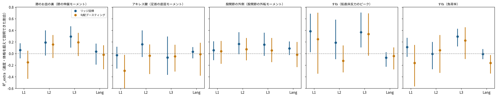

# ステップ4 結果：部位ごとの負担の推定（Fukuchi 2017）

## 結論

- **膝のお皿の裏**（膝の伸展モーメントのピーク）：R²_extra 0.30［0.11〜0.46］、R² 0.40、誤差 15%、信頼度 ★★☆、ピッチ+10%で -8.7%（画面に出す）
- **アキレス腱**（足首の底屈モーメントのピーク）：R²_extra -0.07［-0.36〜0.29］、R² -0.09、誤差 15%、信頼度 ★☆☆、**走り方による違いは推定できない**、ピッチのシミュレーションは画面に出さない
- **股関節の外側**（股関節の外転モーメントのピーク）：R²_extra 0.15［-0.03〜0.35］、R² 0.12、誤差 19%、信頼度 ★★☆、ピッチ+10%で -6.4%（画面に出す）
- **すね**（鉛直床反力のピーク）：R²_extra 0.37［0.11〜0.70］、R² 0.50、誤差 7%、信頼度 ★★★、ピッチのシミュレーションは画面に出さない

R²_extra = 1 − 誤差²(モデル) ÷ 誤差²(速度・体重・身長だけのモデル)。0なら「走り方を見ても、速度と体格から分かる以上のことは分からない」

## データ

```
== マーカーから計算した動画相当の値 ==
歩: 7913、人×速度×脚: 201、人: 39（全39名）
処理できなかった人: []
人×速度ごとの歩数: 中央値 81
左右の割り当てが交互になっている割合（連続する歩）: 中央値 1.00、最小 0.40

除外（人×速度×脚）: 16番 4.5 m/s L（歩数）, 16番 4.5 m/s R（歩数）, 18番 4.5 m/s R（歩数）, 21番 2.5 m/s L（歩数）, 21番 2.5 m/s R（歩数）, 21番 3.5 m/s L（歩数外れ値）, 21番 3.5 m/s R（歩数外れ値）, 21番 4.5 m/s L（外れ値）, 21番 4.5 m/s R（外れ値）, 24番 4.5 m/s R（歩数）, 26番 3.5 m/s L（歩数）, 26番 4.5 m/s L（歩数外れ値）, 26番 4.5 m/s R（外れ値）, 35番 3.5 m/s L（外れ値骨盤マーカー欠け）, 35番 3.5 m/s R（骨盤マーカー欠け）, 37番 3.5 m/s L（歩数）, 37番 3.5 m/s R（歩数）
残り: 184 件（36 名）
```

```
== 負担の指標 ==
人×速度×脚: 202、人: 39
除外: 36番 3.5 m/s L, 37番 3.5 m/s L, 38番 3.5 m/s L, 39番 3.5 m/s L
```

## マーカーから計算した角度と、Loh 2025 の比較（時速10km相当）

| 値 | Fukuchi 平均 ± SD | Loh 2025 ケガなし 平均 ± SD |
|---|---|---|
| mass_kg | 69.72 ± 7.74 | — |
| height_cm | 175.88 ± 6.73 | — |
| cadence_spm | 163.47 ± 9.24 | — |
| duty | 0.70 ± 0.05 | — |
| contact_s | 0.26 ± 0.02 | — |
| CPD | 4.25 ± 2.61 | 5.4 ± 2.6 |
| HADD | 83.00 ± 2.79 | 79.5 ± 4.1 |
| KA | 4.37 ± 3.88 | 1.6 ± 6.3 |
| KF | 37.75 ± 4.46 | 40.8 ± 3.4 |
| knee_flex_contact | 9.50 ± 4.34 | — |
| shank_angle_contact | -7.65 ± 2.15 | — |
| foot_angle_contact | 14.36 ± 6.47 | — |
| overstride | 0.15 ± 0.03 | — |
| pelvis_vertical_osc | 94.35 ± 13.84 | — |

- 股関節の内転（HADD）を「反対側の股関節への線と太ももの線のなす角」として計算すると約83°で、Loh の約80°に近い値になった（差は Loh の SD の約0.8倍）。この定義では内転が大きいほど値が小さくなるので、ステップ3-2の「値が大きいほど内転が小さい」という解釈を支持する
- 骨盤の傾き・膝の屈曲・膝の外反も、Loh との差は SD の0.5〜0.9倍程度。関節中心の定義（Loh は動画上の目視、ここはマーカーからの推定）の違いによるずれが含まれる

## モデルの比較（1人ずつ除く交差検証）



| 指標 | 入力 | 方法 | R² | 誤差（÷平均） | 順位相関 | R²_extra（95%CI） |
|---|---|---|---|---|---|---|
| 膝の伸展モーメントのピーク | L0 | ridge | 0.14 | 16.4% | 0.48 | 0.00（0.00〜0.00） |
| 膝の伸展モーメントのピーク | L0 | gbm | -0.05 | 18.2% | 0.33 | -0.23（-0.54〜0.02） |
| 膝の伸展モーメントのピーク | L1 | ridge | 0.20 | 15.9% | 0.51 | 0.06（-0.08〜0.17） |
| 膝の伸展モーメントのピーク | L1 | gbm | 0.01 | 17.6% | 0.41 | -0.15（-0.43〜0.05） |
| 膝の伸展モーメントのピーク | L2 | ridge | 0.31 | 14.8% | 0.63 | 0.19（-0.03〜0.39） |
| 膝の伸展モーメントのピーク | L2 | gbm | 0.28 | 15.1% | 0.56 | 0.16（-0.07〜0.31） |
| 膝の伸展モーメントのピーク | L3 | ridge | 0.40 | 13.8% | 0.68 | 0.30（0.11〜0.46） |
| 膝の伸展モーメントのピーク | L3 | gbm | 0.31 | 14.7% | 0.59 | 0.20（-0.03〜0.35） |
| 膝の伸展モーメントのピーク | Lang | ridge | 0.17 | 16.1% | 0.51 | 0.04（-0.18〜0.17） |
| 膝の伸展モーメントのピーク | Lang | gbm | 0.13 | 16.6% | 0.46 | -0.02（-0.26〜0.14） |
| 足首の底屈モーメントのピーク | L0 | ridge | -0.02 | 14.1% | 0.15 | 0.00（0.00〜0.00） |
| 足首の底屈モーメントのピーク | L0 | gbm | -0.22 | 15.5% | 0.10 | -0.20（-0.60〜0.01） |
| 足首の底屈モーメントのピーク | L1 | ridge | -0.05 | 14.3% | 0.22 | -0.03（-0.25〜0.11） |
| 足首の底屈モーメントのピーク | L1 | gbm | -0.32 | 16.1% | 0.06 | -0.30（-0.69〜-0.03） |
| 足首の底屈モーメントのピーク | L2 | ridge | 0.14 | 12.9% | 0.52 | 0.16（-0.05〜0.39） |
| 足首の底屈モーメントのピーク | L2 | gbm | -0.06 | 14.4% | 0.25 | -0.04（-0.34〜0.15） |
| 足首の底屈モーメントのピーク | L3 | ridge | -0.09 | 14.6% | 0.39 | -0.07（-0.36〜0.29） |
| 足首の底屈モーメントのピーク | L3 | gbm | -0.07 | 14.5% | 0.21 | -0.05（-0.30〜0.15） |
| 足首の底屈モーメントのピーク | Lang | ridge | 0.01 | 13.9% | 0.25 | 0.03（-0.08〜0.11） |
| 足首の底屈モーメントのピーク | Lang | gbm | -0.03 | 14.2% | 0.25 | -0.01（-0.38〜0.18） |
| 股関節の外転モーメントのピーク | L0 | ridge | -0.04 | 20.1% | 0.02 | 0.00（0.00〜0.00） |
| 股関節の外転モーメントのピーク | L0 | gbm | -0.13 | 20.9% | 0.12 | -0.09（-0.34〜0.12） |
| 股関節の外転モーメントのピーク | L1 | ridge | 0.02 | 19.5% | 0.25 | 0.06（-0.11〜0.21） |
| 股関節の外転モーメントのピーク | L1 | gbm | 0.00 | 19.7% | 0.27 | 0.04（-0.17〜0.21） |
| 股関節の外転モーメントのピーク | L2 | ridge | 0.13 | 18.3% | 0.44 | 0.17（-0.00〜0.36） |
| 股関節の外転モーメントのピーク | L2 | gbm | 0.04 | 19.3% | 0.33 | 0.07（-0.11〜0.26） |
| 股関節の外転モーメントのピーク | L3 | ridge | 0.12 | 18.5% | 0.40 | 0.15（-0.03〜0.35） |
| 股関節の外転モーメントのピーク | L3 | gbm | 0.02 | 19.5% | 0.33 | 0.06（-0.14〜0.26） |
| 股関節の外転モーメントのピーク | Lang | ridge | 0.05 | 19.2% | 0.29 | 0.09（-0.02〜0.20） |
| 股関節の外転モーメントのピーク | Lang | gbm | -0.06 | 20.3% | 0.26 | -0.02（-0.22〜0.19） |
| 鉛直床反力のピーク | L0 | ridge | 0.21 | 8.1% | 0.54 | 0.00（0.00〜0.00） |
| 鉛直床反力のピーク | L0 | gbm | 0.15 | 8.3% | 0.53 | -0.07（-0.39〜0.15） |
| 鉛直床反力のピーク | L1 | ridge | 0.51 | 6.3% | 0.78 | 0.38（0.03〜0.68） |
| 鉛直床反力のピーク | L1 | gbm | 0.40 | 7.0% | 0.77 | 0.25（-0.34〜0.70） |
| 鉛直床反力のピーク | L2 | ridge | 0.36 | 7.3% | 0.71 | 0.19（-0.09〜0.58） |
| 鉛直床反力のピーク | L2 | gbm | 0.11 | 8.6% | 0.51 | -0.12（-0.32〜0.14） |
| 鉛直床反力のピーク | L3 | ridge | 0.50 | 6.4% | 0.77 | 0.37（0.11〜0.70） |
| 鉛直床反力のピーク | L3 | gbm | 0.47 | 6.6% | 0.78 | 0.34（-0.03〜0.69） |
| 鉛直床反力のピーク | Lang | ridge | 0.15 | 8.4% | 0.48 | -0.07（-0.22〜0.02） |
| 鉛直床反力のピーク | Lang | gbm | 0.17 | 8.2% | 0.52 | -0.04（-0.27〜0.10） |
| 負荷率 | L0 | ridge | 0.51 | 30.9% | 0.69 | 0.00（0.00〜0.00） |
| 負荷率 | L0 | gbm | 0.37 | 35.0% | 0.62 | -0.29（-0.48〜-0.14） |
| 負荷率 | L1 | ridge | 0.57 | 29.1% | 0.75 | 0.11（-0.05〜0.27） |
| 負荷率 | L1 | gbm | 0.43 | 33.2% | 0.67 | -0.16（-0.56〜0.14） |
| 負荷率 | L2 | ridge | 0.51 | 30.9% | 0.72 | -0.00（-0.26〜0.20） |
| 負荷率 | L2 | gbm | 0.54 | 29.9% | 0.72 | 0.06（-0.32〜0.31） |
| 負荷率 | L3 | ridge | 0.65 | 25.9% | 0.82 | 0.30（0.13〜0.42） |
| 負荷率 | L3 | gbm | 0.62 | 27.2% | 0.77 | 0.23（-0.09〜0.45） |
| 負荷率 | Lang | ridge | 0.51 | 31.0% | 0.71 | -0.01（-0.09〜0.07） |
| 負荷率 | Lang | gbm | 0.43 | 33.3% | 0.66 | -0.16（-0.34〜-0.03） |

入力：L0 = 速度・体重・身長、L1 = L0＋タイミング、L2 = L0＋角度など、L3 = すべて、Lang = L0＋Loh の4つの角度

## 動画並みの誤差を入力に足した場合（L3 リッジ、R²_extra）

| 指標 | 誤差なし | 誤差1倍 | 誤差2倍 |
|---|---|---|---|
| 膝の伸展モーメントのピーク | 0.30 | 0.20 ± 0.04 | -0.06 ± 0.08 |
| 足首の底屈モーメントのピーク | -0.07 | -0.14 ± 0.05 | -0.30 ± 0.11 |
| 股関節の外転モーメントのピーク | 0.15 | 0.02 ± 0.03 | -0.34 ± 0.08 |
| 鉛直床反力のピーク | 0.37 | 0.28 ± 0.05 | 0.03 ± 0.10 |
| 負荷率 | 0.30 | 0.17 ± 0.03 | -0.19 ± 0.08 |

誤差1倍：角度 3°、オーバーストライド 0.03、骨盤の上下動 10 mm、ピッチ 3 歩/分、Duty factor 0.02、接地時間 0.015 秒（仮の値。ステップ2で置き換える）

## ピッチを変えたときのシミュレーション（平均的なランナー、時速10km）

| 指標 | ピッチの変化 | 負担の変化（95%CI） | 先行研究の向き | 画面に出す |
|---|---|---|---|---|
| 膝の伸展モーメントのピーク | +5% | -4.4%（-7.5〜-0.9） | 下がる | はい |
| 足首の底屈モーメントのピーク | +5% | -1.9%（-5.5〜+0.3） | 一定しない |  |
| 股関節の外転モーメントのピーク | +5% | -3.2%（-7.6〜-0.3） | 下がる | はい |
| 鉛直床反力のピーク | +5% | -2.0%（-4.0〜-0.2） | 一定しない |  |
| 負荷率 | +5% | +6.1%（-2.6〜+13.6） | 一定しない |  |
| 膝の伸展モーメントのピーク | +10% | -8.7%（-14.9〜-1.9） | 下がる | はい |
| 足首の底屈モーメントのピーク | +10% | -3.7%（-11.1〜+0.6） | 一定しない |  |
| 股関節の外転モーメントのピーク | +10% | -6.4%（-15.2〜-0.7） | 下がる | はい |
| 鉛直床反力のピーク | +10% | -4.0%（-8.1〜-0.4） | 一定しない |  |
| 負荷率 | +10% | +12.2%（-5.3〜+27.2） | 一定しない |  |

- 人どうしの違いから作った推定で、同じ人がピッチを変えた実験ではない

## 平均的なランナー（時速10km相当、2.5 と 3.5 m/s から内挿）

| 指標 | 平均 ± SD | 10%点〜90%点 | 脚の数（人） |
|---|---|---|---|
| 膝の伸展モーメントのピーク | 2.87 ± 0.44 | 2.30〜3.43 | 59（30） |
| 足首の底屈モーメントのピーク | 2.21 ± 0.27 | 1.91〜2.56 | 59（30） |
| 股関節の外転モーメントのピーク | 1.66 ± 0.29 | 1.29〜2.03 | 59（30） |
| 鉛直床反力のピーク | 2.37 ± 0.14 | 2.20〜2.55 | 59（30） |
| 負荷率 | 45.74 ± 13.08 | 32.42〜63.39 | 59（30） |

## 限界

- 参加者のほぼ全員が男性（38/39名）
- 36名と少ない
- マーカーから作った値と姿勢推定の値は同じではない（ステップ2で確認）
- 負荷率は、衝撃のピークの検出と記録の接地の仕方の一致が弱い
- ピッチのシミュレーションは人どうしの違いから作った推定で、因果ではない
