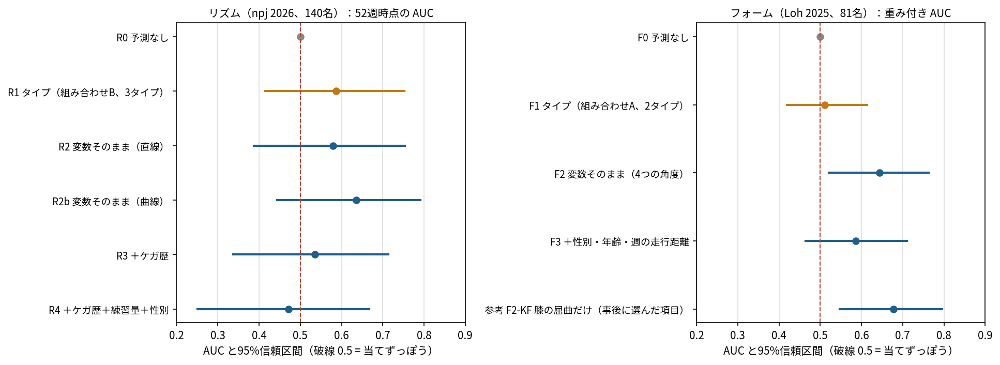
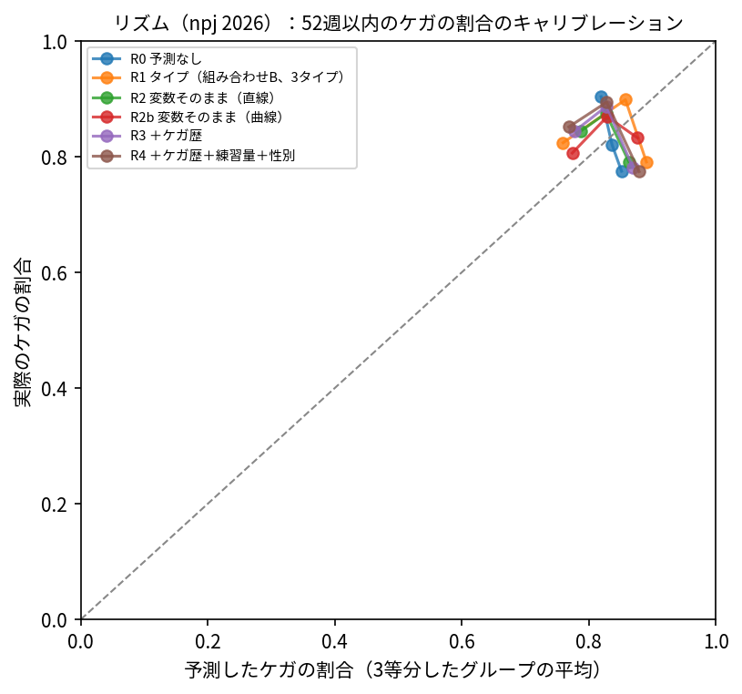
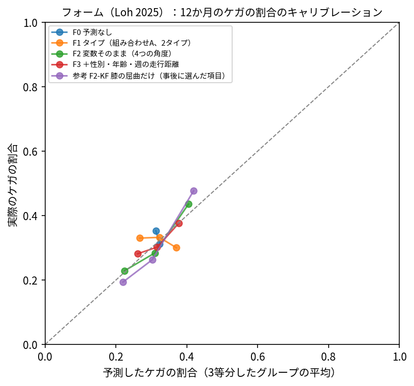

# ステップ5 結果：予測モデルの比較と、論文の AUC の再現

## 結論

### リズム（npj 2026）
- **予測の値に使うモデル：R2 変数そのまま（直線）**。AUC の差の信頼区間が 0 を含む（同程度）ので、決め方どおり変数そのままを採用（AUC の差 -0.008［-0.117〜+0.077］）
- 採用したモデルの AUC：0.579（0.387〜0.753）。**信頼区間が 0.5 を含み、当てずっぽうより良いとは言えない**。画面では「動画の項目だけでは予測の精度は低い」と明記し、予測の値は参考として幅つきで出す
- 予測の広がり（10%点〜90%点）：78%〜87%。人による違いはこの範囲に収まる

### フォーム（Loh 2025）
- **予測の値に使うモデル：F2 変数そのまま（4つの角度）**。AUC の差の信頼区間が 0 を含む（同程度）ので、決め方どおり変数そのままを採用（AUC の差 +0.132［-0.020〜+0.269］）
- 採用したモデルの AUC：0.644（0.520〜0.763）。**当てずっぽう（0.5）より良い**ので、画面に予測の値を幅つきで出す
- 予測の広がり（10%点〜90%点）：21%〜41%。人による違いはこの範囲に収まる

### ケガ歴・練習量を足した場合
- リズム：ケガ歴を足すと AUC は -0.043（-0.069〜-0.021）、さらに練習量と性別を足すと -0.108（-0.204〜-0.031）で、**良くならず、むしろ下がった**
- フォーム：性別・年齢・週の走行距離を足すと AUC は -0.058（-0.118〜-0.008）で、同じく下がった
- この参加者では、ケガ歴や参加時の練習量にも予測の力がほとんどなく、項目を増やすと雑音が増えて悪くなったと考えられる（npj 2026 は参加者の76%が過去1年にケガをしていて、ケガ歴で差が付きにくい）。「ケガ歴や練習量を足せば予測できる」とは、このデータからは言えない

### 論文の AUC の再現（npj 2026、週ごとの行）
- 論文と同じ「行をランダムに10分割」では AUC 0.757、**人ごとに10分割すると 0.476**（根拠の強い39項目、ランダムフォレスト）
- 同じ人の別の週が学習用とテスト用の両方に入ると、その人の特徴（遺伝子型や体格など、週で変わらない値）を覚えるだけで当たりやすくなる。論文の AUC は、この影響で高めに出ていた可能性が高い

## リズム（npj 2026、140名）

人ごとの5分割 × 20回。罰則付き Cox 回帰の罰則の強さは学習データの中で決めた。

| モデル | C-index | 52週時点の AUC | 52週時点の Brier スコア |
|---|---|---|---|
| R0 予測なし | 0.500（0.500〜0.500） | 0.500（0.500〜0.500） | 0.136（0.093〜0.186） |
| R1 タイプ（組み合わせB、3タイプ） | 0.537（0.491〜0.583） | 0.587（0.415〜0.753） | 0.134（0.093〜0.182） |
| R2 変数そのまま（直線） | 0.524（0.462〜0.579） | 0.579（0.387〜0.753） | 0.135（0.094〜0.185） |
| R2b 変数そのまま（曲線） | 0.537（0.478〜0.587） | 0.636（0.444〜0.791） | 0.133（0.095〜0.181） |
| R3 ＋ケガ歴 | 0.501（0.443〜0.551） | 0.536（0.337〜0.713） | 0.137（0.096〜0.187） |
| R4 ＋ケガ歴＋練習量＋性別 | 0.484（0.426〜0.538） | 0.471（0.251〜0.667） | 0.139（0.098〜0.189） |

| 比較 | 指標 | 差（95%CI） |
|---|---|---|
| R2 変数そのまま（直線） − R1 タイプ（組み合わせB、3タイプ） | c_index | -0.013（-0.052〜+0.020） |
| R2 変数そのまま（直線） − R1 タイプ（組み合わせB、3タイプ） | auc_52w | -0.008（-0.117〜+0.077） |
| R2 変数そのまま（直線） − R1 タイプ（組み合わせB、3タイプ） | brier_52w | +0.001（-0.008〜+0.011） |
| R2b 変数そのまま（曲線） − R1 タイプ（組み合わせB、3タイプ） | c_index | -0.000（-0.047〜+0.048） |
| R2b 変数そのまま（曲線） − R1 タイプ（組み合わせB、3タイプ） | auc_52w | +0.049（-0.070〜+0.175） |
| R2b 変数そのまま（曲線） − R1 タイプ（組み合わせB、3タイプ） | brier_52w | -0.000（-0.010〜+0.009） |
| R2 変数そのまま（直線） − R0 予測なし | c_index | +0.024（-0.038〜+0.079） |
| R2 変数そのまま（直線） − R0 予測なし | auc_52w | +0.079（-0.113〜+0.253） |
| R2 変数そのまま（直線） − R0 予測なし | brier_52w | -0.001（-0.007〜+0.004） |
| R1 タイプ（組み合わせB、3タイプ） − R0 予測なし | c_index | +0.037（-0.009〜+0.083） |
| R1 タイプ（組み合わせB、3タイプ） − R0 予測なし | auc_52w | +0.087（-0.085〜+0.253） |
| R1 タイプ（組み合わせB、3タイプ） − R0 予測なし | brier_52w | -0.002（-0.016〜+0.011） |
| R3 ＋ケガ歴 − R2 変数そのまま（直線） | c_index | -0.023（-0.039〜-0.008） |
| R3 ＋ケガ歴 − R2 変数そのまま（直線） | auc_52w | -0.043（-0.069〜-0.021） |
| R3 ＋ケガ歴 − R2 変数そのまま（直線） | brier_52w | +0.003（+0.000〜+0.006） |
| R4 ＋ケガ歴＋練習量＋性別 − R2 変数そのまま（直線） | c_index | -0.041（-0.073〜-0.007） |
| R4 ＋ケガ歴＋練習量＋性別 − R2 変数そのまま（直線） | auc_52w | -0.108（-0.204〜-0.031） |
| R4 ＋ケガ歴＋練習量＋性別 − R2 変数そのまま（直線） | brier_52w | +0.005（-0.002〜+0.011） |
| R4 ＋ケガ歴＋練習量＋性別 − R0 予測なし | c_index | -0.016（-0.074〜+0.038） |
| R4 ＋ケガ歴＋練習量＋性別 − R0 予測なし | auc_52w | -0.029（-0.249〜+0.167） |
| R4 ＋ケガ歴＋練習量＋性別 − R0 予測なし | brier_52w | +0.004（-0.007〜+0.014） |

| モデル | 予測の10%点 | 中央値 | 90%点 |
|---|---|---|---|
| R0 予測なし | 82% | 84% | 86% |
| R1 タイプ（組み合わせB、3タイプ） | 69% | 86% | 90% |
| R2 変数そのまま（直線） | 78% | 83% | 87% |
| R2b 変数そのまま（曲線） | 77% | 83% | 89% |
| R3 ＋ケガ歴 | 78% | 83% | 88% |
| R4 ＋ケガ歴＋練習量＋性別 | 77% | 83% | 89% |

## フォーム（Loh 2025、81名・137脚）

人ごとの5分割（ケガの比率をそろえる）× 50回。脚の重み = 1 ÷ その人の脚の数。

| モデル | AUC | Brier スコア | キャリブレーションの傾き | 切片 |
|---|---|---|---|---|
| F0 予測なし | 0.500（0.500〜0.500） | 0.218（0.183〜0.254） | — | 0.00（-0.50〜0.43） |
| F1 タイプ（組み合わせA、2タイプ） | 0.511（0.420〜0.613） | 0.223（0.186〜0.261） | -0.37（-2.20〜1.70） | 0.01（-0.51〜0.44） |
| F2 変数そのまま（4つの角度） | 0.644（0.520〜0.763） | 0.215（0.181〜0.251） | 0.65（-0.21〜1.90） | 0.02（-0.47〜0.44） |
| F3 ＋性別・年齢・週の走行距離 | 0.586（0.465〜0.710） | 0.221（0.186〜0.257） | 0.53（-0.86〜2.46） | 0.01（-0.50〜0.43） |
| 参考 F2-KF 膝の屈曲だけ（事後に選んだ項目） | 0.678（0.548〜0.795） | 0.210（0.174〜0.246） | 0.79（-0.02〜2.05） | 0.00（-0.47〜0.44） |

| 比較 | 指標 | 差（95%CI） |
|---|---|---|
| F2 変数そのまま（4つの角度） − F1 タイプ（組み合わせA、2タイプ） | auc | +0.132（-0.020〜+0.269） |
| F2 変数そのまま（4つの角度） − F1 タイプ（組み合わせA、2タイプ） | brier | -0.007（-0.025〜+0.010） |
| F2 変数そのまま（4つの角度） − F0 予測なし | auc | +0.144（+0.020〜+0.263） |
| F2 変数そのまま（4つの角度） − F0 予測なし | brier | -0.003（-0.018〜+0.013） |
| F1 タイプ（組み合わせA、2タイプ） − F0 予測なし | auc | +0.011（-0.080〜+0.113） |
| F1 タイプ（組み合わせA、2タイプ） − F0 予測なし | brier | +0.004（-0.003〜+0.012） |
| F3 ＋性別・年齢・週の走行距離 − F2 変数そのまま（4つの角度） | auc | -0.058（-0.118〜-0.008） |
| F3 ＋性別・年齢・週の走行距離 − F2 変数そのまま（4つの角度） | brier | +0.006（-0.002〜+0.013） |
| 参考 F2-KF 膝の屈曲だけ（事後に選んだ項目） − F0 予測なし | auc | +0.178（+0.048〜+0.295） |
| 参考 F2-KF 膝の屈曲だけ（事後に選んだ項目） − F0 予測なし | brier | -0.008（-0.026〜+0.010） |

| モデル | 予測の10%点 | 中央値 | 90%点 |
|---|---|---|---|
| F0 予測なし | 31% | 32% | 32% |
| F1 タイプ（組み合わせA、2タイプ） | 26% | 32% | 38% |
| F2 変数そのまま（4つの角度） | 21% | 31% | 41% |
| F3 ＋性別・年齢・週の走行距離 | 25% | 32% | 37% |
| 参考 F2-KF 膝の屈曲だけ（事後に選んだ項目） | 21% | 30% | 43% |

- キャリブレーションの傾きは1が理想。1より小さいと、予測が極端すぎる（過学習）

## 論文の AUC の再現（npj 2026、週ごと6,181行、ランダムフォレスト、5回繰り返し）

| 入力の項目 | 評価の分け方 | 各分割の AUC の平均 ± SD | テスト用の予測をまとめた AUC |
|---|---|---|---|
| 39項目から追跡中のケガの記録を除く | 人ごとに10分割 | 0.495 ± 0.062 | 0.486 |
| 39項目から追跡中のケガの記録を除く | 行をランダムに10分割（論文と同じ） | 0.743 ± 0.032 | 0.743 |
| 全257項目（項目選択なし） | 人ごとに10分割 | 0.532 ± 0.072 | 0.518 |
| 全257項目（項目選択なし） | 行をランダムに10分割（論文と同じ） | 0.756 ± 0.033 | 0.756 |
| 根拠の強い39項目（class 1） | 人ごとに10分割 | 0.476 ± 0.076 | 0.467 |
| 根拠の強い39項目（class 1） | 行をランダムに10分割（論文と同じ） | 0.757 ± 0.031 | 0.757 |

- 論文の値：ランダムフォレスト 0.781（class 1）、0.784（all features）。論文は項目の選択を全データで行っているが、ここでは選択せず全部使った

## 限界

- 人数が少なく（リズム：ケガ105名、フォーム：ケガ26名）、AUC の信頼区間は広い
- タイプのモデルは、交差検証の学習データごとにタイプを作り直している（方法とタイプの数はステップ3で採用したものに固定）
- フォームの膝の屈曲だけのモデルは、ステップ3-2の結果を見てから選んだ項目なので、楽観的に出る
- C-index と AUC は、交差検証の同じ分割の中の組だけで計算した（全分割をまとめると、分割ごとの予測の水準のずれで不当に低く出るため）
- 外部のデータでの検証はしていない
